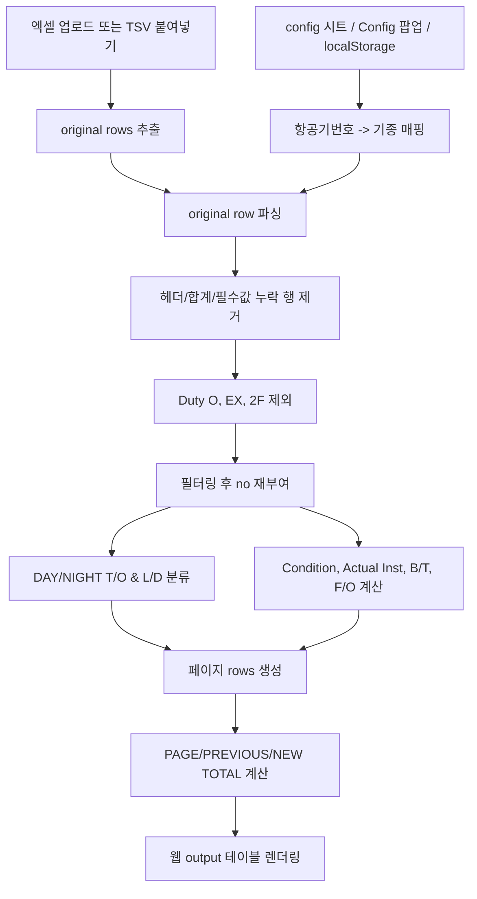

# Flight Time 웹사이트 비즈니스 로직 문서

이 문서는 현재 웹사이트가 `original` 입력과 `config` 입력을 어떤 방식으로 읽고, 최종 `output` 테이블의 각 컬럼을 어떻게 결정하는지 정리한 문서입니다.

기준 코드:

- `src/core/flighttime-core.js`
- `app.js`

## 1. 입력 데이터

### 1.1 `original` 입력

웹사이트는 다음 두 방식으로 `original` 데이터를 받습니다.

1. 엑셀 파일 업로드
   - workbook의 첫 번째 시트를 사용합니다.
2. 텍스트 붙여넣기
   - 탭(`\t`)으로 구분된 TSV 형식으로 해석합니다.

`original` 행은 아래 컬럼 순서로 해석됩니다.

*original 데이터를 받아서 표출할 때 T/O, L/D 열에 0이 적혀 있을 경우 0을 적지 말고 공백으로 놔두기

| original index | 의미 | 내부 필드명 | 처리 방식 |
|---:|---|---|---|
| 0 | A/C No | `aircraft` | 문자열 trim |
| 1 | Date | `date` | 엑셀 날짜 또는 문자열을 `YYYY-MM-DD`/문자열로 변환 |
| 2 | Duty | `duty` | 문자열 trim |
| 3 | Flight No | `flightNo` | 문자열 trim |
| 4 | From | `from` | 문자열 trim |
| 5 | To | `to` | 문자열 trim |
| 6 | Type | `type` | `config` 매핑이 있으면 config 값 우선, 없으면 original 값 사용 |
| 7 | RO | `ro` | 문자열 trim |
| 8 | RI | `ri` | 문자열 trim |
| 9 | Block Time | `blockTime` | 분 단위 숫자로 변환 |
| 10 | Takeoff Time | `takeoffTime` | 문자열 trim, 현재 output 계산에는 미사용 |
| 11 | Landing Time | `landingTime` | 문자열 trim, 현재 output 계산에는 미사용 |
| 12 | Air Time | `airTime` | 분 단위 숫자로 변환, 현재 output 계산에는 미사용 |
| 13 | Inst | `inst` | 분 단위 숫자로 변환 |
| 14 | Night | `night` | 분 단위 숫자로 변환 |
| 15 | Takeoff Count | `takeoff` | 숫자로 변환 |
| 16 | Landing Count | `landing` | 숫자로 변환 |


### 1.2 `original` 행 제외/무시 조건

다음 행은 계산 대상에서 제외됩니다.

| 조건 | 설명 |
|---|---|
| 첫 셀이 `A/C No`인 경우 | 헤더가 있는 데이터로 보고 앞의 2행을 건너뜁니다. |
| 행의 어떤 셀이라도 `계`를 포함 | 합계/요약 행으로 보고 제외합니다. |

### 1.3 `config` 입력

`config`는 항공기번호별 기종 매핑입니다.

입력/관리 방식:

1. 기본 config DB는 GitHub의 `data/aircraft-types.json`입니다.
   - 화면 로드 시 이 JSON을 fetch해서 `A/C No → aircraftType` 매핑으로 사용합니다.
   - GitHub Pages 빌드 산출물에도 포함됩니다.
2. 웹사이트의 `Config` 버튼 팝업에서 브라우저별 local override를 입력할 수 있습니다.
   - local override는 GitHub DB보다 우선 적용됩니다.
   - 저장 위치는 브라우저 `localStorage`입니다.
3. 업로드한 workbook에 `config`/`Config` 시트가 있으면 해당 매핑도 읽어서 local override로 저장합니다.

## 2. 공통 변환 규칙

### 2.1 문자열 정리

모든 주요 문자열은 다음 규칙을 따릅니다.

- `null`/`undefined`는 빈 문자열 `""`로 처리
- 나머지는 문자열로 변환 후 앞뒤 공백 제거

### 2.2 시간/기간 변환

내부 계산은 모두 `분(minutes)` 단위 숫자로 합니다.

| 입력 형태 | 처리 |
|---|---|
| 빈 값 | `0` |
| `0 < number < 1` | 엑셀 day fraction으로 보고 `number * 24 * 60` 후 반올림 |
| `number >= 1` | 이미 분 단위로 보고 반올림 |
| `Date` 객체 | `hours * 60 + minutes` |
| `HH:MM` 문자열 | `HH * 60 + MM` |
| 그 외 문자열 | `0` |

화면 출력 시 시간 값은 `HH:MM` 형식으로 변환합니다.

- 값이 없거나 `0`이면 빈 문자열 `""`
- 상단 요약의 `B/T`, `Actual Inst.`는 빈 값이면 `00:00`으로 표시

### 2.3 숫자 변환

- 빈 값은 `0`
- 숫자로 변환 가능하면 숫자
- 숫자로 변환 불가하면 `0`

## 3. 필터링 로직

`original`에서 파싱된 행 중 Duty가 아래 값이면 `output` 대상에서 제외합니다.

| 제외 Duty |
|---|
| `O` |
| `EX` |
| `2F` |
| `NF` | `Math.round(blockTime * 2 / 3)` |

비교는 대소문자를 구분하지 않습니다.

예: `o`, `O` 모두 제외.

## 4. 페이지 로직

### 4.1 페이지 크기

선택 가능한 rows 값:

| UI 값 | 내부 page size |
|---|---:|
| `19` | 19 |
| `All` | 현재 필터링된 전체 행 수 |

기본값은 `19`입니다.

`All`인데 행이 0개면 내부 계산 안정성을 위해 page size를 `1`로 처리합니다.

### 4.2 페이지 번호와 no

필터링 후 남은 행에 대해 1부터 순번을 다시 매깁니다.

| 내부 필드 | 계산 |
|---|---|
| `id` / output `no` | 필터링 후 index + 1 |
| `page` | `Math.floor(index / pageSize) + 1` |
| 현재 페이지 rows | `(currentPage - 1) * pageSize`부터 `pageSize`개 |
| Start | 현재 페이지 첫 행의 `id` |
| End | 현재 페이지 마지막 행의 `id` |
| Count | 현재 페이지 행 수 |

## 5. output 행별 컬럼 결정 방식

아래 표는 화면의 output 테이블 각 컬럼이 어떤 input 또는 계산 로직으로 결정되는지 나타냅니다.

| output 컬럼 | 내부 필드 | 결정 방식 | 의존 input |
|---|---|---|---|
| DATE (Mon / Day) | `date` | original 날짜를 그대로 사용 | original index 1 |
| AIRCRAFT TYPE | `aircraftType` | `config[aircraft]`가 있으면 config 값, 없으면 original Type | config index 0~1, original index 0, 6 |
| AIRCRAFT IDENT | `aircraftIdent` | original A/C No | original index 0 |
| FROM | `from` | original From | original index 4 |
| TO | `to` | original To | original index 5 |
| FLT. NO. | `flightNo` | original Flight No | original index 3 |
| DAY T/O | `dayTakeoff` | 주야간 분류 로직 결과 | original index 3, 9, 14, 15, 16 |
| DAY L/D | `dayLanding` | 주야간 분류 로직 결과 | original index 3, 9, 14, 15, 16 |
| NIGHT T/O | `nightTakeoff` | 주야간 분류 로직 결과 | original index 3, 9, 14, 15, 16 |
| NIGHT L/D | `nightLanding` | 주야간 분류 로직 결과 | original index 3, 9, 14, 15, 16 |
| A/L | `autoLand` | 현재 항상 빈 값 | 없음 |
| CONDITION OF FLT. DAY | `dayCondition` | `max(blockTime - night, 0)` | original index 9, 14 |
| CONDITION OF FLT. NIGHT | `nightCondition` | `night` 값. 0이면 빈 값 | original index 14 |
| ACTUAL INST. | `actualInst` | `inst` 값. 0이면 빈 값 | original index 13 |
| TYPE&NO INST. APP | `instApp` | 현재 항상 빈 값 | 없음 |
| B/T | `blockTime` | Duty가 `NF`이면 `Math.round(blockTime * 2 / 3)`, 그 외에는 `blockTime` 값. 0이면 빈 값 | original index 2, 9 |
| PIC | `pic` | 현재 항상 빈 값 | 없음 |
| F/O | `fo` | Duty별 F/O 계산 | original index 2, 9 |
| TYPE OF PILOTING TIME 빈 칸 | `otherPilot` | 현재 항상 빈 값 | 없음 |
| FLIGHT SIMULATOR | `simulator` | 현재 항상 빈 값 | 없음 |
| AS FLIGHT INSTRUCTOR | `flightInstructor` | 현재 항상 빈 값 | 없음 |
| AS SIMULATOR INSTRUCTOR | `simulatorInstructor` | 현재 항상 빈 값 | 없음 |
| REMARK | `remark` | 현재 항상 빈 값 | 없음 |
| no | `id` | 필터링 후 순번 | 필터링 결과 |

## 6. DAY/NIGHT T/O & L/D 분류 로직

`DAY T/O`, `DAY L/D`, `NIGHT T/O`, `NIGHT L/D`는 아래 순서로 결정됩니다.

사용 값:

| 값 | 설명 |
|---|---|
| `takeoff` | original index 15 |
| `landing` | original index 16 |
| `night` | original index 14, 분 단위 |
| `blockTime` | original index 9, 분 단위 |
| `flightNo` | original index 3 |

### 6.1 Night 시간이 없는 경우

조건:

```txt
night <= 0
```

결과:

| output | 값 |
|---|---|
| DAY T/O | `takeoff` |
| DAY L/D | `landing` |
| NIGHT T/O | 빈 값 |
| NIGHT L/D | 빈 값 |

### 6.2 Night 시간이 Block Time과 같은 경우

조건:

```txt
night > 0 && night === blockTime
```

결과:

| output | 값 |
|---|---|
| DAY T/O | 빈 값 |
| DAY L/D | 빈 값 |
| NIGHT T/O | `takeoff` |
| NIGHT L/D | `landing` |

### 6.3 공항별 일출·일몰 기준 주/야간 판정

이륙(T/O)과 착륙(L/D) 항목은 각각 해당 공항(From/To)의 IATA 코드를 기준으로 일출 및 일몰 시간을 조회하여 주간(DAY)과 야간(NIGHT)을 판정합니다.

**[판정 기준]**
* **주간 (DAY):** 일출 시간부터 일몰 시간까지
* **야간 (NIGHT):** 일몰 시간부터 일출 시간까지

---

#### 1) 이륙 (T/O) 판정 규칙

* **기준 공항:** `From` 공항의 IATA 코드
* **판정 방식:** 출발 시간이 해당 공항의 일출/일몰 시간 중 어느 범위에 속하는지 확인

| 구분 | 조건 | DAY T/O | NIGHT T/O |
|---|---|---|---|
| **주간 이륙** | 출발 시간이 `From` 공항의 **주간** 범위에 속함 | `takeoff` | 빈 값 |
| **야간 이륙** | 출발 시간이 `From` 공항의 **야간** 범위에 속함 | 빈 값 | `takeoff` |

---

#### 2) 착륙 (L/D) 판정 규칙

* **기준 공항:** `To` 공항의 IATA 코드
* **판정 방식:** 도착 시간이 해당 공항의 일출/일몰 시간 중 어느 범위에 속하는지 확인

| 구분 | 조건 | DAY L/D | NIGHT L/D |
|---|---|---|---|
| **주간 착륙** | 도착 시간이 `To` 공항의 **주간** 범위에 속함 | `landing` | 빈 값 |
| **야간 착륙** | 도착 시간이 `To` 공항의 **야간** 범위에 속함 | 빈 값 | `landing` |### 6.4 그 외 Night 일부 포함 비행

조건:

```txt
night > 0 && night !== blockTime && specialFlightNo(flightNo) === false
```

결과:

| output | 값 |
|---|---|
| DAY T/O | `takeoff` |
| DAY L/D | 빈 값 |
| NIGHT T/O | 빈 값 |
| NIGHT L/D | `landing` |

## 7. CONDITION OF FLT. 계산

### 7.1 DAY

```txt
dayCondition = max(blockTime - night, 0)
```

- 결과가 `0`이면 화면에는 빈 값으로 표시합니다.
- 출력 형식은 `HH:MM`입니다.

### 7.2 NIGHT

```txt
nightCondition = night
```

- 결과가 `0`이면 화면에는 빈 값으로 표시합니다.
- 출력 형식은 `HH:MM`입니다.

### 7.3 ACTUAL INST.

```txt
actualInst = inst
```

- 결과가 `0`이면 화면에는 빈 값으로 표시합니다.
- 출력 형식은 `HH:MM`입니다.

## 8. F/O 계산

F/O는 Duty와 Block Time으로 결정됩니다.

| Duty | F/O 계산 |
|---|---|
| `F` | `blockTime` 전체 |
| `NF` | `Math.round(blockTime * 2 / 3)` |
| 그 외 | 빈 값 |

Duty 비교는 대문자로 변환 후 수행합니다.

예:

| Duty | Block Time | F/O |
|---|---:|---:|
| `F` | 90분 | 90분 |
| `NF` | 90분 | 60분 |
| `R` | 90분 | 빈 값 |

## 9. 합계 로직

화면 하단에는 세 종류의 합계가 표시됩니다.

| 합계 행 | 계산 범위 |
|---|---|
| PAGE TOTAL | 현재 페이지에 표시된 rows |
| PREVIOUS TOTAL | 현재 페이지 이전의 모든 rows |
| NEW TOTAL | 이전 rows + 현재 페이지 rows |

합산 대상:

| output 컬럼 | 합계 필드 | 합산 방식 |
|---|---|---|
| DAY T/O | `dayTakeoff` | 숫자 합산 |
| DAY L/D | `dayLanding` | 숫자 합산 |
| NIGHT T/O | `nightTakeoff` | 숫자 합산 |
| NIGHT L/D | `nightLanding` | 숫자 합산 |
| CONDITION DAY | `dayCondition` | 분 단위 합산 후 `HH:MM` 표시 |
| CONDITION NIGHT | `nightCondition` | 분 단위 합산 후 `HH:MM` 표시 |
| ACTUAL INST. | `actualInst` | 분 단위 합산 후 `HH:MM` 표시 |
| B/T | `blockTime` | 분 단위 합산 후 `HH:MM` 표시 |
| F/O | `fo` | 분 단위 합산 후 `HH:MM` 표시 |

합계 행에서 현재 항상 빈 값인 컬럼:

- DATE
- AIRCRAFT TYPE
- AIRCRAFT IDENT
- FROM
- FLT. NO. 위치 외 대부분의 텍스트 컬럼
- A/L
- TYPE&NO INST. APP
- PIC
- 기타 pilot/simulator/instructor/remark/no 컬럼

## 10. 화면 상단 통계/요약 값

| UI 표시 | 결정 방식 |
|---|---|
| 원본 | 파싱 후 유효한 `originalRows.length` |
| 출력 | Duty 필터 적용 후 남은 행 수 |
| 페이지 | 현재 page size 기준 최대 페이지 수 |
| page in 1~N | 최대 페이지 수 표시 |
| Start | 현재 페이지 첫 row의 `id` |
| End | 현재 페이지 마지막 row의 `id` |
| Count | 현재 페이지 행 수 |
| B/T | 현재 페이지 `blockTime` 합계 |
| Actual Inst. | 현재 페이지 `actualInst` 합계 |

## 11. 현재 항상 빈 값으로 출력되는 필드

아래 output 필드는 현재 코드상 입력과 연결되어 있지 않고 항상 빈 값입니다.

| output 컬럼 | 내부 필드 |
|---|---|
| A/L | `autoLand` |
| TYPE&NO INST. APP | `instApp` |
| PIC | `pic` |
| TYPE OF PILOTING TIME 빈 칸 | `otherPilot` |
| FLIGHT SIMULATOR | `simulator` |
| AS FLIGHT INSTRUCTOR | `flightInstructor` |
| AS SIMULATOR INSTRUCTOR | `simulatorInstructor` |
| REMARK | `remark` |

## 12. 전체 처리 흐름



## 13. 주의사항 / 현재 비즈니스 규칙의 암묵적 가정

1. `config` 매핑은 original Type보다 우선합니다.
2. Duty `O`, `EX`, `2F`는 output에서 제외됩니다.
3. `original`의 `Takeoff Time`, `Landing Time`, `Air Time`은 파싱은 하지만 현재 output 계산에는 쓰지 않습니다.
4. `NF`의 B/T와 F/O는 Block Time의 2/3을 반올림합니다.
5. Night 일부 포함 비행의 T/O/L/D 분류는 Flight No 특수 규칙에 따라 갈립니다.
6. Original의 시간 값(`RO`, `RI`)은 UTC 기준으로 간주하며, 공항 일출/일몰도 UTC로 조회해 같은 기준에서 비교합니다. UTC 기준 일출 시각이 일몰 시각보다 늦으면(예: ICN의 UTC 낮 구간이 자정을 넘는 경우) `일출 이상 또는 일몰 전`을 주간으로 봅니다.
7. 시간 값은 내부적으로 분 단위로 계산하고 화면에는 `HH:MM`으로 표시합니다.
8. `0`인 시간 값은 대부분 빈 값으로 표시되며, 상단 요약의 `B/T`, `Actual Inst.`만 빈 값 대신 `00:00`을 표시합니다.
