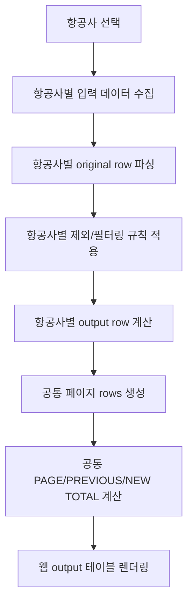

# Flight Time 웹사이트 비즈니스 로직 문서

이 문서는 Flight Time 웹사이트의 비즈니스 로직 문서 구조를 설명합니다.

입력 형식, 출력 컬럼, 필터링, 시간 계산, 크레딧 계산처럼 항공사마다 달라질 수 있는 규칙은 항공사별 문서에서 관리합니다. 공통 앱 구조와 항공사 선택 방식만 이 문서에 남깁니다.

기준 코드:

- `src/core/flighttime-core.js`
- `src/core/airlines.js`
- `src/App.jsx`
- `src/app-controller.js`

## 1. 항공사별 문서

| 항공사 | 문서 | 설명 |
|---|---|---|
| T'way Air | [business-logic-tway.md](./business-logic-tway.md) | T'way `original` 입력, `config` 입력, output 컬럼 결정, Duty 필터, B/T, F/O, DAY/NIGHT T/O & L/D 계산 규칙 |

## 2. 공통 앱 흐름

## 3. 공통 책임과 항공사별 책임

| 영역 | 공통 문서 범위 | 항공사별 문서 범위 |
|---|---|---|
| 항공사 정의 | `src/core/airlines.js`에서 항공사별 규칙을 선택한다는 구조 | 항공사 ID, 표시명, 제외 Duty, 크레딧 계산 규칙 |
| 입력 | 파일 업로드/TSV 붙여넣기 흐름 | 원본 컬럼 순서, config 의미, 무시할 행 |
| 변환 | 문자열, 숫자, 시간 값을 표준 내부 값으로 변환하는 기반 함수 | 어떤 원본 컬럼을 어떤 내부 필드로 볼지 |
| 필터링 | 필터링 후 순번과 페이지를 다시 계산하는 방식 | 제외 Duty와 항공사별 제외 조건 |
| 출력 | 페이지/합계 테이블을 렌더링하는 공통 구조 | output 컬럼별 값 결정 방식 |
| 계산 | 합계 계산의 공통 집계 방식 | B/T, F/O, PIC, DAY/NIGHT, 기타 항공사별 크레딧 계산 |

## 4. 공통 페이지/합계 규칙

항공사별 필터링과 output row 계산이 끝난 뒤에는 공통 페이지 로직을 적용합니다.

| 항목 | 공통 규칙 |
|---|---|
| `id` / output `no` | 필터링 후 남은 행에 대해 1부터 다시 부여 |
| `page` | `Math.floor(index / pageSize) + 1` |
| PAGE TOTAL | 현재 페이지에 표시된 rows 합계 |
| PREVIOUS TOTAL | 현재 페이지 이전의 모든 rows 합계 |
| NEW TOTAL | 이전 rows + 현재 페이지 rows 합계 |

합계 대상 컬럼과 표시 형식은 항공사별 output row가 제공하는 필드에 따라 달라질 수 있으므로 각 항공사 문서에서 함께 관리합니다.
